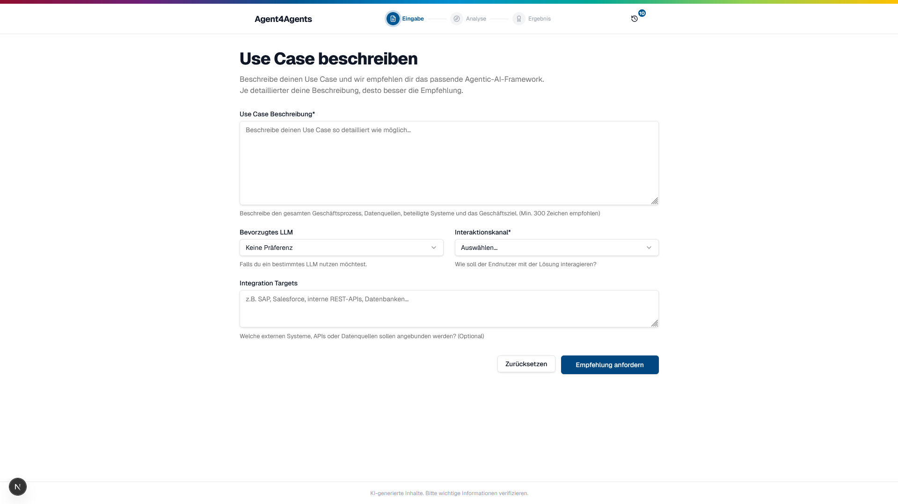
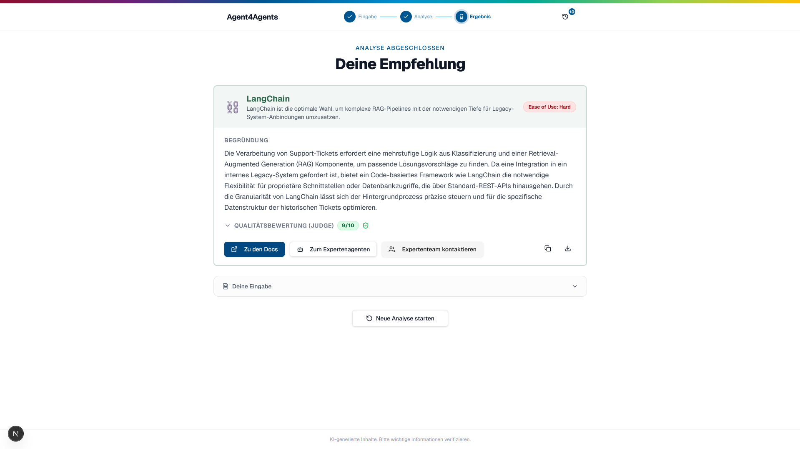
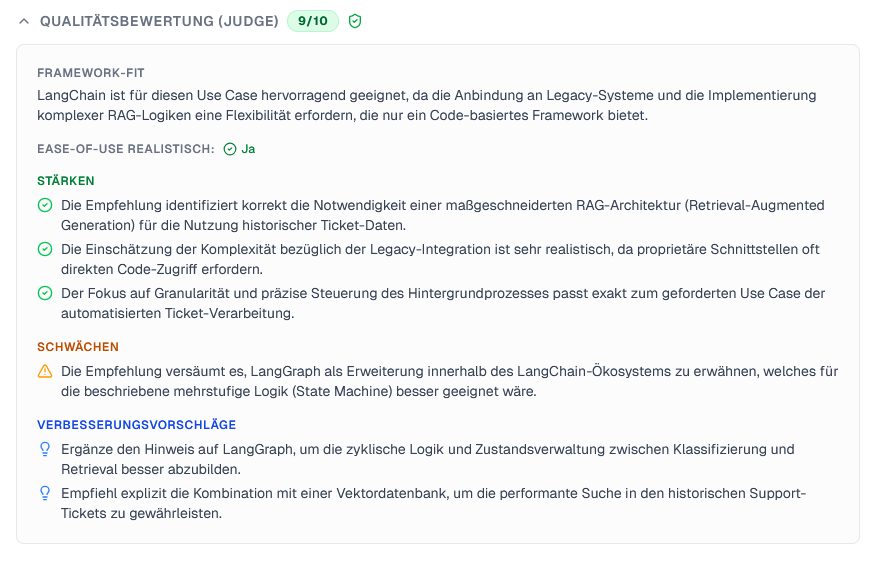
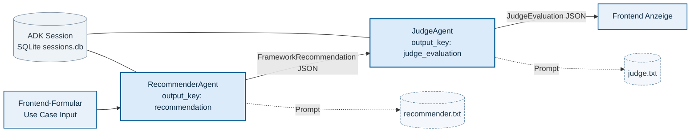
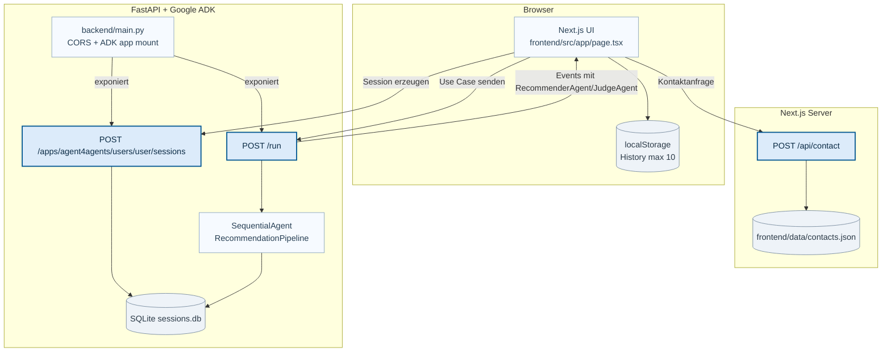

# Agent4Agents (Google ADK)

**Uniprojekt in Kooperation mit Bosch.**

Umgesetzt von **Felix Schöck, Amy Klein und Dennis Simutin**.

Agent4Agents ist ein internes Empfehlungstool für Bosch, das anhand eines strukturierten Use Cases genau ein KI-Framework vorschlägt und diese Empfehlung anschließend durch einen zweiten Agenten qualitativ bewerten lässt.

Die Anwendung besteht aus:

- einem Frontend in Next.js (deutsche UI)
- einem Backend in FastAPI + Google ADK
- einer sequentiellen Zwei-Agenten-Pipeline (Recommender → Judge)

## Screenshots





## Ziel der App

Die App beantwortet die Frage: **„Welches Framework ist für meinen Use Case am sinnvollsten – bei möglichst hoher Umsetzbarkeit (Ease of Use)?“**

Nutzer geben dazu strukturierte Informationen ein:

- Use-Case-Beschreibung
- bevorzugtes Modell-Ökosystem
- Interaktionskanal (z. B. Chatbot, API, Hintergrundprozess)
- Integrationsziele

Die App liefert danach:

1. eine konkrete Framework-Empfehlung
2. eine transparente Begründung
3. optional eine Alternative ohne KI
4. eine unabhängige Qualitätsbewertung dieser Empfehlung

## Framework-Portfolio (fixe Auswahl)

Die Empfehlung ist auf diese Optionen begrenzt:

- `N8N`
- `Cognigy`
- `Google ADK`
- `CrewAI`
- `OpenAI SDK`
- `Claude SDK`
- `LangChain`
- `LangGraph`
- `Keine KI nötig`

## Agentenarchitektur

Das Backend nutzt einen `SequentialAgent` mit zwei LLM-Sub-Agenten. Beide Agenten verwenden aktuell `gemini-3-flash-preview` und geben strikt strukturiertes JSON aus.

### Mermaid: Zwei-Agenten-Pipeline



### RecommenderAgent

Datei: `backend/agent4agents/agent.py`

Aufgabe:

- Wählt **genau ein** Framework aus der fixen Portfolio-Liste.
- Priorisiert Ease of Use und vermeidet Over-Engineering.
- Prüft zuerst, ob der Use Case auch ohne KI sinnvoll lösbar ist.

Strukturierter Output (`FrameworkRecommendation`):

- `framework: str`
- `ease_of_use: "High" | "Medium" | "Hard"`
- `summary: str`
- `reasoning: str`
- `ki_notwendig: bool`
- `alternative_ohne_ki: str`

### JudgeAgent

Datei: `backend/agent4agents/agent.py`

Aufgabe:

- Bewertet die Empfehlung des Recommenders als LLM-as-a-Judge.
- Prüft Framework-Fit, Realismus der Ease-of-Use-Bewertung, Begründungsqualität und Alternativen.

Strukturierter Output (`JudgeEvaluation`):

- `score: int (1-10)`
- `strengths: list[str]`
- `weaknesses: list[str]`
- `improvement_suggestions: list[str]`
- `framework_fit: str`
- `ease_of_use_realistic: bool`

## Softwarearchitektur

### Mermaid: Systemübersicht



## Laufzeit-Datenfluss (Request bis Ergebnis)

1. Nutzer füllt das Formular im Frontend aus.
2. Frontend erstellt eine neue ADK-Session:
   - `POST http://localhost:8000/apps/agent4agents/users/user/sessions`
3. Frontend sendet den Use Case an ADK:
   - `POST http://localhost:8000/run`
   - `app_name = "agent4agents"`
4. ADK führt die Pipeline sequentiell aus:
   - Recommender erzeugt `recommendation`
   - Judge bewertet und erzeugt `judge_evaluation`
5. Frontend parst die Event-Liste über `event.author`:
   - `RecommenderAgent`
   - `JudgeAgent`
6. Ergebnis wird in der UI angezeigt und optional in `localStorage` gespeichert.

## Projektstruktur

```text
backend/
	main.py                         # FastAPI Wrapper + ADK App Mount
	agent4agents/
		__init__.py                   # ADK Discovery (import agent)
		agent.py                      # Schemas + Recommender/Judge + root_agent
		infra.py                      # Logger (und Erweiterungspunkt für Infra-Helfer)
		prompts/
			recommender.txt             # System Prompt Recommender (XML-strukturiert)
			judge.txt                   # System Prompt Judge (XML-strukturiert)

frontend/
	src/app/page.tsx                # Formular, API-Aufrufe, Event-Parsing, Ergebnisansicht
	src/components/recommendation-card.tsx
	src/components/history-panel.tsx
	src/components/contact-dialog.tsx
	src/hooks/use-recommendation-history.ts
	src/app/api/contact/route.ts    # Speichert Kontaktanfragen in data/contacts.json
	data/contacts.json
```

## Technologiestack

- Frontend: Next.js 16, React 19, TypeScript, Tailwind CSS 4, react-hook-form, zod
- Backend: FastAPI, Google ADK, Pydantic
- Laufzeitmodell (beide Agenten): `gemini-3-flash-preview`
- Session-Persistenz: SQLite (`backend/sessions.db`)
- Paketmanager:
  - Backend: `uv`
  - Frontend: `pnpm`

## Voraussetzungen

- Node.js (für Next.js)
- `pnpm`
- Python `>= 3.13`
- `uv`

## Lokales Setup

### 1) Backend starten

```bash
cd backend
uv sync
uv run main.py
```

Backend läuft standardmäßig auf `http://localhost:8000`.

### 2) Frontend starten

```bash
cd frontend
pnpm install
pnpm dev
```

Frontend läuft standardmäßig auf `http://localhost:3000`.

> Beide Server müssen gleichzeitig laufen.

## API-Übersicht

### ADK/FastAPI (Backend)

- `POST /apps/agent4agents/users/user/sessions`
  - erzeugt eine Session (`session_id`)
- `POST /run`
  - führt die Agentenpipeline aus
  - erwartet `app_name`, `user_id`, `session_id`, `newMessage`

### Kontakt (Frontend API Route)

- `POST /api/contact`
  - validiert Input via `zod`
  - speichert Einträge in `frontend/data/contacts.json`

## Besondere Implementierungsdetails

- **Strikte JSON-Ausgaben:** Prompts verlangen explizit „nur valides JSON“.
- **Event-basiertes Parsing im Frontend:** Ergebniszuordnung über `event.author`.
- **Session-Speicherung mit Blick auf Erweiterbarkeit:** Sessions werden bewusst gespeichert, um spätere Erweiterungen wie Multi-Turn-Verläufe, Follow-up-Fragen, Kontext-Wiederaufnahme und serverseitige Nachvollziehbarkeit zu ermöglichen.
- **Historie im Browser:** max. 10 Einträge in `localStorage`.
- **Export & Copy:** Empfehlungen können als Markdown exportiert oder in die Zwischenablage kopiert werden.
- **Kontaktkontext:** Kontaktanfragen enthalten Empfehlung + Formulardaten als Kontext.

## Erweiterung: Neues Framework hinzufügen

1. Neues Framework in beide Prompts aufnehmen:
   - `backend/agent4agents/prompts/recommender.txt`
   - `backend/agent4agents/prompts/judge.txt`
2. Falls nötig Schema/Validierung in `backend/agent4agents/agent.py` anpassen.
3. Metadaten im Frontend ergänzen:
   - `frontend/src/components/recommendation-card.tsx` (`FRAMEWORK_META`)

## Typische Fehlerbilder

- Frontend zeigt keine Ergebnisse:
  - Prüfen, ob Backend auf Port `8000` läuft.
  - Prüfen, ob Session-Request erfolgreich ist.
- CORS-Probleme:
  - `ALLOWED_ORIGINS` in `backend/main.py` prüfen.
- JSON-Parse-Fehler:
  - Prompt-Ausgabeformat in `recommender.txt`/`judge.txt` prüfen (muss valides JSON sein).

## Aktueller Status

- Kein dediziertes Test-Framework konfiguriert.
- Fokus liegt auf funktionierender End-to-End-Empfehlung mit transparenter Agentenbewertung.
